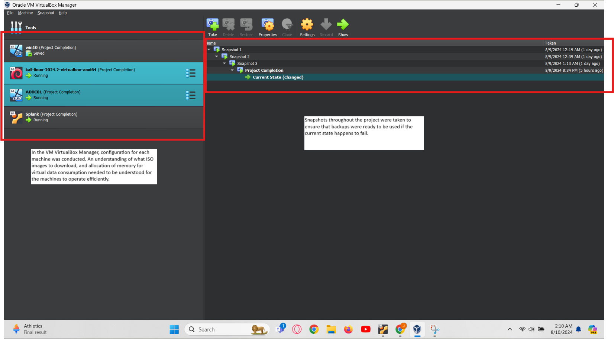
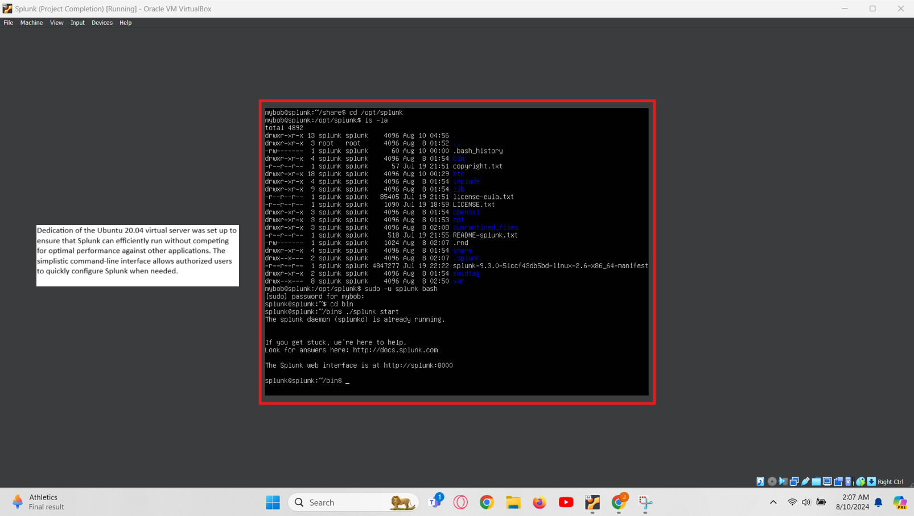
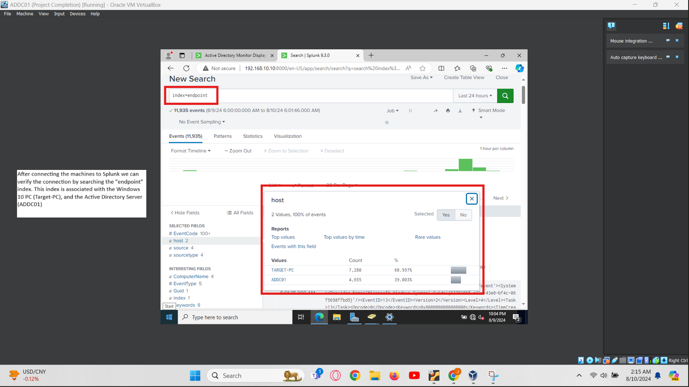
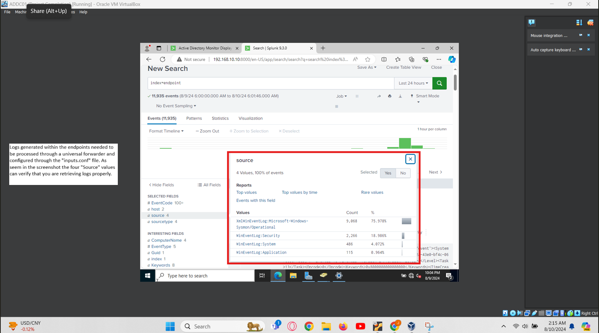
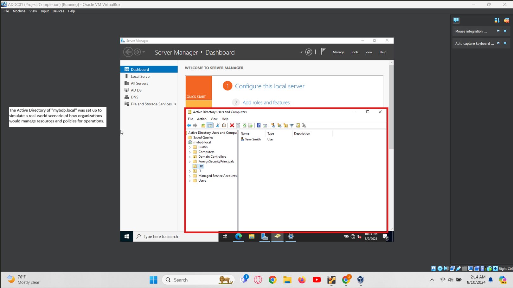
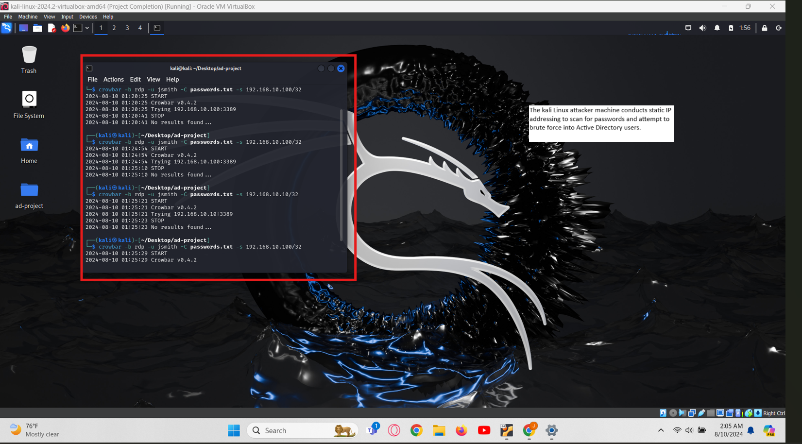
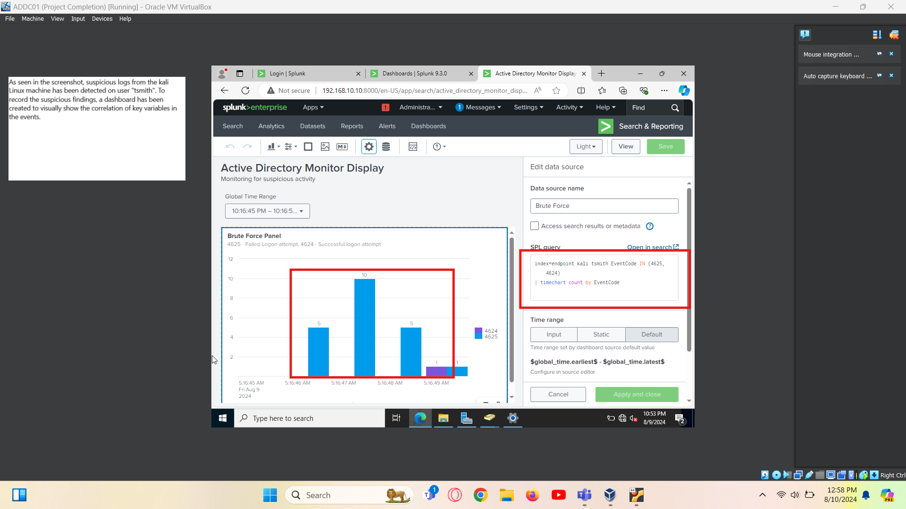

# Active Directory Home Lab - Screenshots Documentation

This document provides an overview of the screenshots included in the `screenshots` subfolder of the Active Directory Home Lab project. These screenshots capture various stages of the lab setup, configuration, and monitoring processes.

## Screenshots Overview

- **Description**: Oracle VM VirtualBox Manager interface showing the configuration of virtual machines.
- **Details**: 
  - Lists various projects and their statuses.
  - Highlights the importance of understanding ISO downloads and memory allocation for efficient VM operation.

- **Description**: Splunk directory structure and configuration.
- **Details**: 
  - Shows the Splunk directory and file permissions.
  - Emphasizes the need for optimal performance and resource allocation for Splunk.

- **Description**: Project composition planning in Oracle VM VirtualBox.
- **Details**: 
  - Focuses on integrating machines with Splunk and connecting to the Active Directory server.

- **Description**: Log processing and configuration in Splunk.
- **Details**: 
  - Illustrates the use of universal forwarders and the `inputs.conf` file for log retrieval.

- **Description**: Project composition status in Oracle VM VirtualBox.
- **Details**: 
  - Displays the running status of the project components.

- **Description**: File system view of the project directory.
- **Details**: 
  - Shows the logical structure and file actions within the project directory.

- **Description**: Splunk dashboard for monitoring suspicious activities.
- **Details**: 
  - Highlights the detection of suspicious logs from a Kali Linux machine.
  - Demonstrates the creation of a dashboard to visualize key variables in the events.

## Usage

These screenshots are intended to provide a visual guide to the setup and configuration processes involved in the Active Directory Home Lab. They can be used as a reference to ensure proper configuration and to troubleshoot any issues that may arise during the lab setup.

---

For further details, refer to the main [README](./README.md) of the Active Directory Home Lab project.
